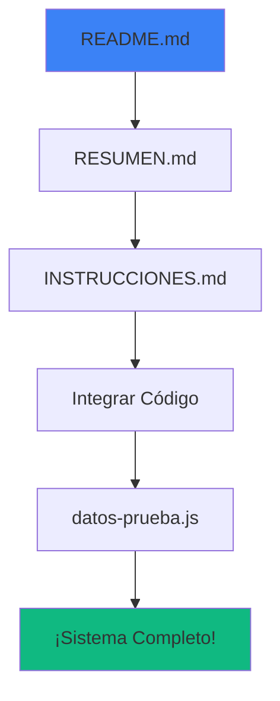

# 📋 ÍNDICE DE ARCHIVOS CREADOS

## ✅ Resumen del Proyecto

Se han creado **7 archivos nuevos** que extienden el Sistema de Inventario con funcionalidades de **gestión de proveedores** y **análisis de utilidades**.

---

## 📁 ARCHIVOS CREADOS

### 📚 Documentación (3 archivos)

| Archivo | Tamaño | Descripción | Prioridad |
|---------|--------|-------------|-----------|
| **README.md** | 12 KB | 📖 Punto de entrada principal | ⭐⭐⭐ LEER PRIMERO |
| **RESUMEN.md** | 8.6 KB | 📊 Vista general de funcionalidades | ⭐⭐ Segundo |
| **INSTRUCCIONES.md** | 16.5 KB | 📝 Guía detallada de integración | ⭐⭐⭐ Esencial |

### 💻 Código Fuente (3 archivos)

| Archivo | Tamaño | Líneas | Descripción |
|---------|--------|--------|-------------|
| **suppliers-module.js** | 17.6 KB | ~455 | Lógica del módulo de proveedores |
| **estilos-adicionales.css** | 8.1 KB | ~400 | Estilos para nuevas vistas |
| **elementos-adicionales.html** | 8.4 KB | ~200 | Plantillas HTML a integrar |

### 🧪 Utilidades (1 archivo)

| Archivo | Tamaño | Descripción |
|---------|--------|-------------|
| **datos-prueba.js** | 11.4 KB | Script con 4 proveedores y 12 productos de ejemplo |

### 📋 Este Índice

| Archivo | Descripción |
|---------|-------------|
| **INDICE.md** | Este archivo de referencia rápida |

---

## 🎯 ORDEN DE LECTURA SUGERIDO



1. 📖 **README.md** - Empezar aquí para entender el proyecto
2. 📊 **RESUMEN.md** - Ver todas las funcionalidades visualmente
3. 📝 **INSTRUCCIONES.md** - Seguir paso a paso la integración
4. 💻 **Integrar archivos de código** según las instrucciones
5. 🧪 **datos-prueba.js** - Probar con datos de ejemplo
6. ✅ **¡Disfrutar del sistema completo!**

---

## 🗂️ ESTRUCTURA DEL PROYECTO

```
src-extracted/
│
├── 📄 ARCHIVOS PRINCIPALES (Ya existían)
│   ├── index.html                    (29.6 KB) - App principal
│   ├── app.js                        (34.8 KB) - Lógica principal
│   ├── styles.css                    (19.9 KB) - Estilos base
│   ├── main.js                       (1.1 KB) - Electron main
│   └── package.json                  (915 B) - Configuración
│
├── 📦 ARCHIVOS NUEVOS - CÓDIGO
│   ├── suppliers-module.js           (17.6 KB) ⭐ Módulo principal
│   ├── estilos-adicionales.css       (8.1 KB) ⭐ Estilos nuevos
│   └── elementos-adicionales.html    (8.4 KB) ⭐ Plantillas
│
├── 📚 ARCHIVOS NUEVOS - DOCUMENTACIÓN
│   ├── README.md                     (12 KB) 📖 Inicio
│   ├── RESUMEN.md                    (8.6 KB) 📊 Resumen
│   ├── INSTRUCCIONES.md              (16.5 KB) 📝 Guía
│   └── INDICE.md                     (Este archivo)
│
└── 🧪 ARCHIVOS NUEVOS - PRUEBAS
    └── datos-prueba.js               (11.4 KB) 🧪 Datos ejemplo
```

**Total archivos nuevos creados**: 8  
**Tamaño total agregado**: ~83 KB  
**Líneas de código nuevo**: ~1,050 líneas

---

## 📊 ESTADÍSTICAS

### Por Tipo de Archivo:

| Tipo | Cantidad | Tamaño Total | % del Total |
|------|----------|--------------|-------------|
| JavaScript (.js) | 2 | 29 KB | 35% |
| Markdown (.md) | 4 | 37.6 KB | 45% |
| CSS (.css) | 1 | 8.1 KB | 10% |
| HTML (.html) | 1 | 8.4 KB | 10% |
| **TOTAL** | **8** | **83.1 KB** | **100%** |

### Por Propósito:

| Propósito | Archivos | Descripción |
|-----------|----------|-------------|
| 📚 Documentación | 4 | Guías y referencias |
| 💻 Código Funcional | 3 | Implementación |
| 🧪 Testing | 1 | Datos de prueba |

---

## 🎨 FUNCIONALIDADES IMPLEMENTADAS

### ✅ Gestión de Proveedores
- Crear, editar, eliminar proveedores
- Búsqueda y filtrado
- Información de contacto completa
- Contador de productos por proveedor

### ✅ Productos Mejorados
- Campo de número de pieza
- Asociación con proveedor
- Costo de compra
- Precio público
- Cálculo automático de utilidad

### ✅ Reportes
- Reporte de utilidades por producto
- Comparativa de proveedores
- Clasificación por colores
- Recomendaciones automáticas

### ✅ UI/UX
- Badges de clasificación
- Tablas mejoradas con acciones
- Diseño responsivo
- Animaciones suaves
- Estilos de impresión

---

## 🔧 TECNOLOGÍAS UTILIZADAS

| Tecnología | Uso | Archivos |
|------------|-----|----------|
| **JavaScript (Vanilla)** | Lógica del módulo | suppliers-module.js |
| **CSS3** | Estilos y animaciones | estilos-adicionales.css |
| **HTML5** | Plantillas y vistas | elementos-adicionales.html |
| **LocalStorage API** | Persistencia de datos | suppliers-module.js |
| **Markdown** | Documentación | 4 archivos .md |

---

## 📈 MEJORAS AL SISTEMA ORIGINAL

### Antes:
```javascript
// Producto simple
{
    code: 'ACC001',
    name: 'Aceite',
    price: 299.99,    // Un solo precio
    stock: 45
}
```

### Después:
```javascript
// Producto completo con análisis
{
    code: 'ACC001',
    partNumber: '5W30-1L',      // ✨ NUEVO
    name: 'Aceite Motor 5W-30',
    supplierId: 'supp_1',       // ✨ NUEVO
    cost: 180.00,               // ✨ NUEVO
    publicPrice: 299.99,        // ✨ Renombrado
    stock: 45,
    utility: 66.66%             // ✨ Calculado
}
```

---

## 🎯 CASOS DE USO

### 1. Para el Dueño del Negocio
- Ver utilidad total del inventario
- Comparar proveedores
- Encontrar productos con bajo margen
- Tomar decisiones de precios

### 2. Para el Gerente
- Gestionar catálogo de proveedores
- Asociar productos con proveedores
- Generar reportes de rentabilidad
- Optimizar compras

### 3. Para el Vendedor
- Conocer el margen al vender
- Identificar productos de alta utilidad
- Sugerir productos rentables

---

## ⏱️ TIEMPO DE INTEGRACIÓN

| Paso | Tiempo Estimado | Dificultad |
|------|----------------|------------|
| Leer documentación | 15 min | ⭐ Fácil |
| Agregar CSS y JS | 5 min | ⭐ Fácil |
| Integrar vistas HTML | 10 min | ⭐⭐ Media |
| Modificar app.js | 15-20 min | ⭐⭐ Media |
| Probar funcionalidades | 10 min | ⭐ Fácil |
| **TOTAL** | **45-60 min** | **⭐⭐ Media** |

---

## 📝 CHECKLIST DE INTEGRACIÓN

```
Preparación:
□ Leer README.md
□ Leer RESUMEN.md
□ Leer INSTRUCCIONES.md

Integración de Archivos:
□ Agregar estilos-adicionales.css al index.html
□ Agregar suppliers-module.js al index.html
□ Integrar vista de proveedores
□ Integrar modal de proveedores
□ Actualizar formulario de productos
□ Agregar tarjetas de nuevos reportes

Modificaciones a app.js:
□ Actualizar initializeDefaultData()
□ Actualizar loadData()
□ Actualizar setupNavigation()
□ Actualizar renderProductsTable()
□ Actualizar openAddProductModal()
□ Actualizar editProduct()
□ Actualizar handleProductSubmit()
□ Actualizar setupEventListeners()

Pruebas:
□ Verificar consola sin errores
□ Probar agregar proveedor
□ Probar agregar producto con costos
□ Probar cálculo automático de utilidad
□ Generar reporte de utilidades
□ Generar comparativa de proveedores
□ Cargar datos de prueba (opcional)

□ ✅ INTEGRACIÓN COMPLETA
```

---

## 🆘 ENLACES RÁPIDOS

- 🐛 **Problemas?** → Ver [Solución de Problemas](INSTRUCCIONES.md#-solución-de-problemas-comunes)
- 📖 **Detalles Técnicos?** → Ver [INSTRUCCIONES.md](INSTRUCCIONES.md)
- 🎨 **Ver Funcionalidades?** → Ver [RESUMEN.md](RESUMEN.md)
- 🧪 **Datos de Prueba?** → Ejecutar [datos-prueba.js](datos-prueba.js)

---

## 📞 SOPORTE

### Pasos Recomendados:
1. Revisar este INDICE.md
2. Consultar INSTRUCCIONES.md
3. Ver sección de Solución de Problemas
4. Revisar comentarios en el código
5. Verificar la consola del navegador (F12)

---

## 🎉 RESULTADO FINAL

Después de la integración completa, tendrás:

✅ **Módulo de Proveedores** totalmente funcional  
✅ **Sistema de Costos** y precios integrado  
✅ **Cálculos de Utilidad** automáticos  
✅ **Reportes Avanzados** de rentabilidad  
✅ **Comparativa de Proveedores** para toma de decisiones  
✅ **UI Moderna** con badges y clasificación por colores  

---

## 📜 VERSIÓN Y FECHA

**Versión del Módulo**: 1.0.1  
**Fecha de Creación**: 24 de Noviembre de 2025  
**Compatible con**: Sistema de Inventario v1.0.1  
**Estado**: ✅ Listo para producción

---

## 🏆 RECONOCIMIENTOS

**Desarrollado para**: Refaccionaria Smip  
**Propósito**: Mejorar la gestión de inventario y rentabilidad  
**Impacto Esperado**: Mayor control de costos y mejor toma de decisiones  

---

<div align="center">

**📦 Sistema de Inventario - Módulo de Proveedores y Utilidades**

[⬅️ Volver al README](README.md) | [📊 Ver Resumen](RESUMEN.md) | [📝 Ver Instrucciones](INSTRUCCIONES.md)

---

*Hecho con ❤️ para optimizar tu negocio*

</div>
